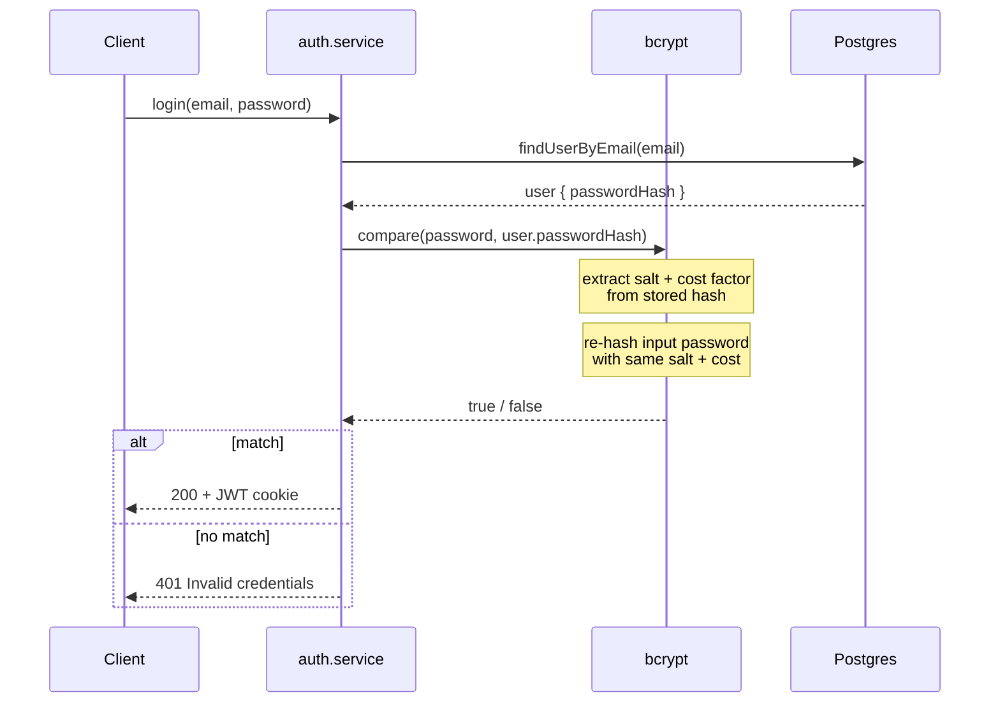

## File Structure 
```
backend/
├── src/
│   ├── config/
│   │   └── prisma.ts          # PrismaClient singleton
│   ├── modules/
│   │   └── auth/
│   │       ├── auth.routes.ts
│   │       ├── auth.controller.ts
│   │       ├── auth.service.ts   # bcrypt, jwt logic
│   │       └── auth.validation.ts # input validation (zod recommended)
│   ├── middleware/
│   │   └── authMiddleware.ts
│   ├── utils/
│   │   └── jwt.ts
│   ├── app.ts                 # express app, mounts routes
│   └── server.ts              # starts the server
├── prisma/
│   └── schema.prisma
├── .env
└── package.json
```


## System Design — Auth Service
### Data Model
```
User
├── id            UUID (PK)
├── username      string, unique
├── email         string, unique
├── passwordHash  string
├── avatarUrl     string, nullable
├── createdAt     datetime
└── updatedAt     datetime
```
### Register
```
Client → POST /auth/register { username, email, password }
  → auth.validation: check format, password length
  → auth.service.createUser():
      - bcrypt.hash(password, 10) → passwordHash
      - prisma.user.create()
  → utils/jwt.signToken({ userId }) → JWT
  → Set-Cookie: token=<JWT> (httpOnly, secure, sameSite)
  ← 201 { user (no passwordHash) }
```
### Login
```
Client → POST /auth/login { email, password }
  → auth.service.findUserByEmail()
  → bcrypt.compare(password, user.passwordHash)
  → if match: sign JWT, set cookie → 200 { user }
  → if no match: 401 (generic "invalid credentials", don't reveal which field failed)
```
### Protected route (e.g. /auth/me)
```
Client → GET /auth/me (cookie sent automatically)
  → authMiddleware:
      - read cookie
      - jwt.verify(token, SECRET)
      - attach req.user = { id: userId }
      - if invalid/missing: 401, stop here
  → controller reads req.user → returns user data
```
### Logout
```
Client → POST /auth/logout
  → clear cookie (Set-Cookie: token=; Max-Age=0)
  ← 200
  ```

